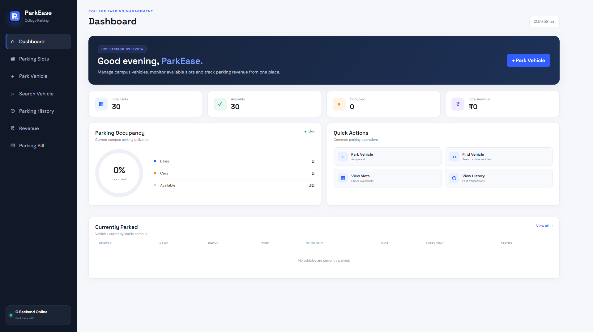
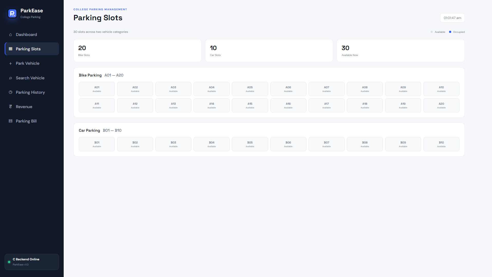
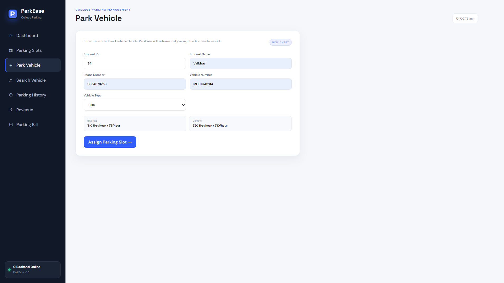
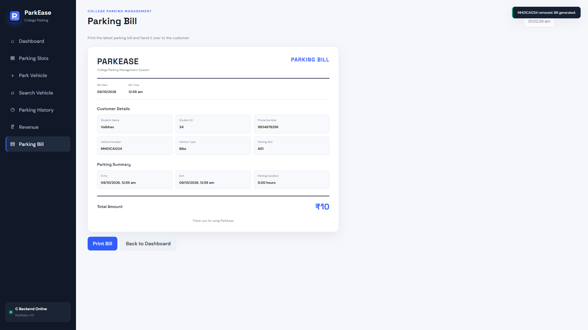

<div align="center">

# 🅿️ PARKEASE

### College Parking Management System

A web-based parking management system designed to simplify  
vehicle entry, slot allocation, parking records and bill generation.

<br>

<a href="YOUR_RENDER_URL">
  
</a>
&nbsp;
<a href="https://github.com/vaibhav-buildss/ParkEaseV2">
  
</a>

<br><br>


</div>

---

## ✦ About

**ParkEase** is a college parking management system developed to manage
vehicles entering and leaving a campus parking area.

The system combines a **C backend** with a lightweight web interface,
allowing staff to manage parking slots, student details, vehicle records,
parking history and printable parking bills from one application.

> Built as a BCA college project with a focus on simplicity,
> functionality and understanding the underlying C programming concepts.

---

## 🚘 What ParkEase Can Do

<table>
<tr>
<td width="50%">

### 🅿️ Smart Parking

- Automatic slot allocation
- 20 bike slots
- 10 car slots
- Live slot visualization
- Occupied / available status

</td>

<td width="50%">

### 👤 Student & Vehicle Records

- Student ID
- Student name
- Phone number
- Vehicle number
- Vehicle type
- Parking slot

</td>
</tr>

<tr>
<td width="50%">

### 🔎 Vehicle Search

Quickly find a parked vehicle using
its vehicle number and view its
parking information.

</td>

<td width="50%">

### 🧾 Parking Bills

Generate a complete parking bill
when a vehicle leaves and print it
directly for the customer.

</td>
</tr>

<tr>
<td width="50%">

### 📋 Parking History

Keep track of previous parking
transactions and vehicle activity.

</td>

<td width="50%">

### 💰 Revenue

View parking revenue generated
from completed parking transactions.

</td>
</tr>
</table>

---

# 🖥️ Interface

> Add your screenshots inside `docs/screenshots/` and update the filenames below.

### Dashboard

<p align="center">
  
</p>

### Parking Slots

<p align="center">
  
</p>

### New Parking Entry

<p align="center">
  
</p>

### Parking Bill

<p align="center">
  
</p>

---

# ⚙️ How It Works

```text
                    PARKEASE
                       │
                       ▼
              ┌─────────────────┐
              │   Web Frontend  │
              │ HTML / CSS / JS │
              └────────┬────────┘
                       │
                       ▼
              ┌─────────────────┐
              │   Node.js       │
              │  Server Bridge  │
              └────────┬────────┘
                       │
                       ▼
              ┌─────────────────┐
              │   C Backend     │
              │    api.c        │
              └────────┬────────┘
                       │
                       ▼
              ┌─────────────────┐
              │   File Storage  │
              │     .dat files  │
              └─────────────────┘